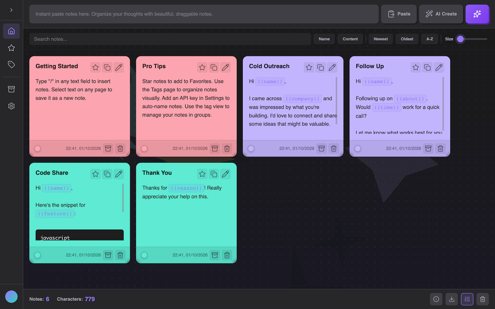
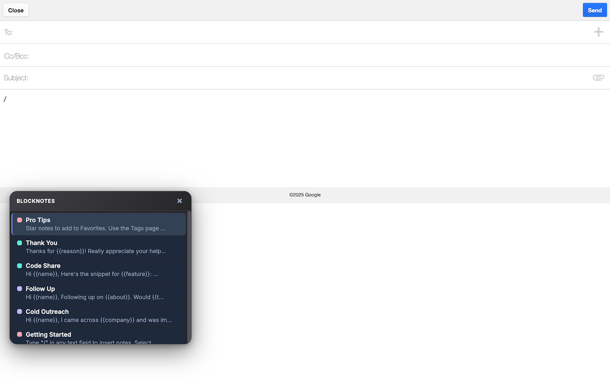

# BlockNotes — Smart Clipboard & Text Expander

A context-aware text expander for rapid productivity.
Save snippets, templates, and code blocks — insert them anywhere by typing `/`.

No fluff. No friction. Just flow.



---

## Features

### Core
- **Slash Command** — Type `/` in any text field to search and insert snippets instantly
- **Text Selection** — Select text on any page to save it as a new snippet
- **Smart Search** — Real-time filtering by name or content
- **Dynamic Placeholders** — Use `{{placeholder}}` syntax for context-aware templates
- **Code Blocks** — Markdown code block support with syntax highlighting

### Organization
- **Color Tags** — Organize snippets with 8 color options
- **Multiple Views** — All Snippets, Favorites, Archive, and Tags
- **Tags View** — Visual kanban-style organization by color
- **Drag & Drop** — Reorder snippets with visual drag handles
- **Favorites** — Star important snippets for quick access

### AI Features (Optional)
- **Auto-Naming** — Automatically generate snippet titles
- **Tone Rewriting** — Adjust tone (Professional, Friendly, Concise, Persuasive, Casual)
- **Multiple Providers** — OpenAI, Anthropic Claude, Google Gemini, Groq

### Design
- **Neobrutalist UI** — Bold, clean interface with offset shadows
- **Responsive** — Works on desktop, tablet, and mobile
- **Mobile Menu** — Slide-out navigation on small screens
- **Adjustable Grid** — Resize snippets with the size slider
- **Keyboard Friendly** — Navigate with arrows, Enter to insert, Esc to close
- **First-Run Walkthrough** — Guided introduction for new users (click background to skip)

---

## Quick Start

1. Install the extension from the Chrome Web Store
2. Click the BlockNotes icon to open the main dashboard
3. Create snippets with the input field at the top
4. Type `/` in any text field on any webpage to search and insert snippets

---

## User Guide

### Creating and Saving Notes

**From the Dashboard:**
1. Click the BlockNotes icon in your browser toolbar to open the dashboard
2. Enter a title in the "Note title..." field
3. Enter your note content in the text area below
4. Click the **+** button or press Enter to save

**From Any Webpage:**
1. Highlight any text on a webpage
2. A small BlockNotes button appears near your selection
3. Click the button to save the selected text as a new note
4. The note is automatically named (if AI is configured) or given a default name

**Tips:**
- Notes can contain plain text, code blocks, or dynamic placeholders
- There's no limit to note length (up to 5000 characters)
- New notes appear at the top of your list

---

### Using Notes with Slash Search



**Basic Usage:**
1. Click into any text field on any webpage (email, chat, forms, etc.)
2. Type `/` to open the BlockNotes popup
3. Start typing to filter your notes by name or content
4. Use arrow keys to navigate, then press **Enter** to insert

**Search Features:**
- Search matches both note titles and content
- Results are sorted by relevance (title matches appear first)
- Frequently used notes are prioritized
- Recently used notes appear higher in results

---

### Editing Notes and Templates

**Editing a Note:**
1. Hover over a note card in the dashboard
2. Click the **pencil icon** to enter edit mode
3. Modify the title and/or content
4. Click the **checkmark** to save or **X** to discard changes
5. Press **Enter** in the title field to quick-save
6. Press **Escape** to discard changes

**Using Placeholders:**
Placeholders let you create reusable templates with fill-in-the-blank fields.

1. While editing a note, click the **{{}}** button
2. If you have text selected, it becomes the placeholder name
3. If nothing is selected, it inserts `{{placeholder}}`
4. When you insert the note, you'll be prompted to fill in each placeholder

**Example:**
```
Hi {{name}},

Thanks for reaching out about {{topic}}. I'd love to schedule a call for {{date}}.

Best,
{{signature}}
```

**Using Code Blocks:**
1. While editing, click the **code icon** to insert a code block
2. Or manually type triple backticks: ``` before and after your code
3. Code blocks are syntax-highlighted when displayed

---

### AI-Powered Features

BlockNotes includes optional AI features that require an API key.

**Setting Up AI:**
1. Open Settings from the sidebar
2. Choose your AI provider (OpenAI, Anthropic, Google Gemini, or Groq)
3. Enter your API key
4. Select your preferred model

**Tone Rewriting:**
Transform your note's tone with one click:
1. Click the **edit icon** on a note
2. Click the **Aa icon** (type icon) that appears
3. Choose a tone: Professional, Friendly, Concise, Persuasive, or Casual
4. The AI rewrites your content in the selected tone
5. Accept or discard the changes

**Auto-Naming:**
- **New Notes:** AI automatically generates descriptive titles when creating notes from the dashboard
- **Saved Selections:** AI automatically names text selections saved from webpages
- Both options are enabled by default and can be toggled independently in Settings

**Template Generation:**
1. Click the **AI Create** button (wand icon) in the note creation area
2. The input field switches to AI mode
3. Describe the template you want (e.g., "meeting follow-up email")
4. Press Enter and AI generates a complete template with placeholders
5. The note is automatically saved to your collection

---

### Note Organization

**Color Tags:**
1. Hover over a note and click the **color circle**
2. Choose from 8 colors to categorize your notes
3. Use the **Tags** view to see notes grouped by color

**Views:**
- **All Notes:** Your complete collection
- **Favorites:** Starred notes for quick access
- **Tags:** Visual kanban-style view organized by color
- **Archive:** Hidden notes you want to keep but not see regularly

**Favorites:**
- Click the **star icon** on any note to favorite it
- Favorites appear in their own view for quick access

**Archive:**
- Click the **archive icon** to hide a note from your main view
- Archived notes are preserved but out of the way
- Access them anytime from the Archive view

**Drag and Drop:**
- On desktop: drag notes directly to reorder
- On mobile/tablet: use the grip handle that appears at the top
- Your custom order is preserved across sessions

**Note Size:**
- Use the slider in Settings to adjust note card size
- Range from 240px to 600px width

---

### Import and Export

**Exporting Your Notes:**
1. Open Settings from the sidebar
2. Click **Export Notes**
3. A JSON file downloads with all your notes

**Importing Notes:**
1. Open Settings from the sidebar
2. Click **Import Notes**
3. Select a previously exported JSON file
4. Your notes are restored

**Backup Tip:** Export regularly to keep a backup of your notes.

---

## Starter Templates

BlockNotes includes helpful starter notes:
- **Getting Started** — Quick intro to using BlockNotes
- **Pro Tips** — Power user features
- **Cold Outreach** — Email template with `{{name}}` and `{{company}}`
- **Follow Up** — Email template with `{{name}}`, `{{about}}`, and `{{time}}`
- **Code Share** — Mixed code and text template
- **Thank You** — Quick appreciation with `{{reason}}`

---

## Settings

Access settings from the sidebar:
- **AI Configuration** — Choose provider (OpenAI, Anthropic, Gemini, Groq), model, and API key
- **Auto-fill Placeholders** — Fill placeholders from page context
- **Play Sounds** — Toggle audio feedback
- **Auto-name New Notes** — Automatically name notes created from the dashboard using AI
- **Auto-name Saved Selections** — Automatically name text selections using AI
- **Note Size** — Adjust the grid size (240px - 600px)
- **Export/Import** — Backup and restore your notes as JSON

**Note:** The Save Settings button turns amber when you have unsaved changes.

---

## Keyboard Shortcuts

| Action | Shortcut |
|--------|----------|
| Open notes popup | `/` |
| Force open popup | `Ctrl+Shift+/` |
| Navigate notes | Arrow keys |
| Insert note | Enter |
| Close popup | Escape |
| Save edit | Enter (in title) |
| Discard edit | Escape |

---

## Privacy

All notes stay in your browser.
No accounts, no syncing, no servers, no data collection.
Your data never leaves your device.

---

## Browser Support

- Chrome (recommended)
- Brave
- Edge
- Other Chromium-based browsers

---

**Version:** 3.0
**Updated:** January 2025
